# blog-platform-django


[繁體中文版 README.md | Traditional Chinese README.md](https://github.com/ycy-tw/blog-platform-django/blob/55c8137b00d3cbb822eb11bfd96a6d929e2e8f88/README_zhhant.md)

This is a writing platform built by Django framework. Beside the posting function, it also contains social media features, such as Like, Follow, Bookmark and Notification.

Frontend template was purchased through [Themeforest](https://themeforest.net/), even I added a lot of custom css, part of frontend code still won't include in this repo.

:link: [KnowsList](https://www.knowslist.com/) :point_left: View the live demo


## Screenshots

- Homepage
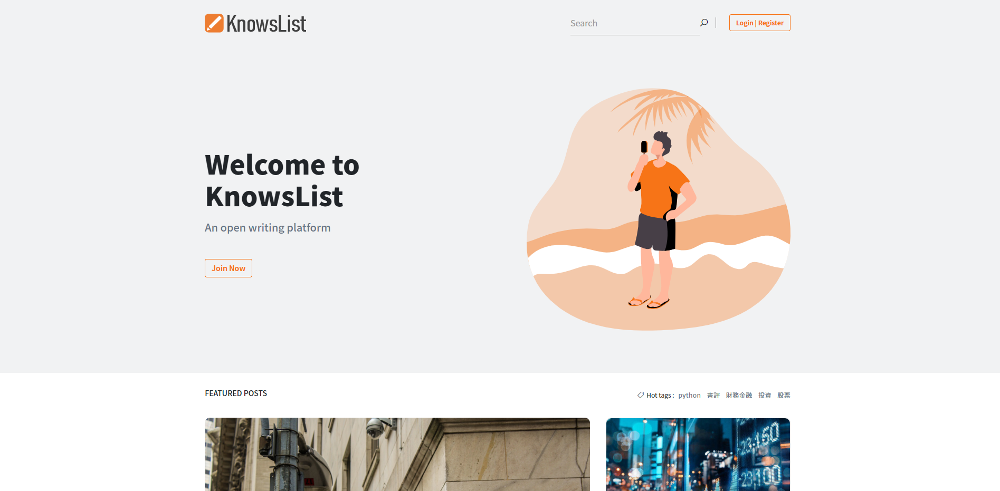
- Editor
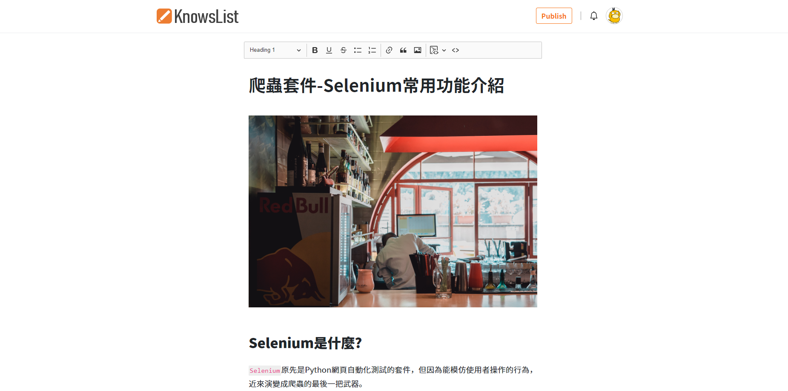
- Article
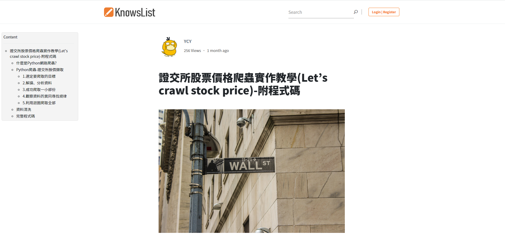
- Related Posts & Comment
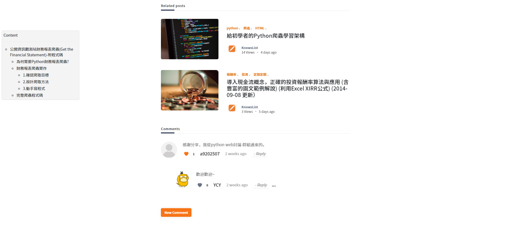
- Search
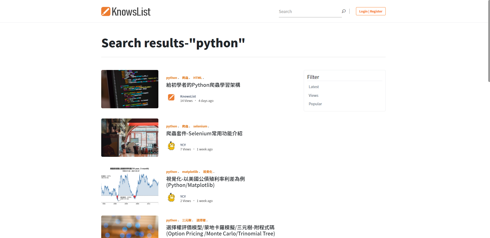
- Profile
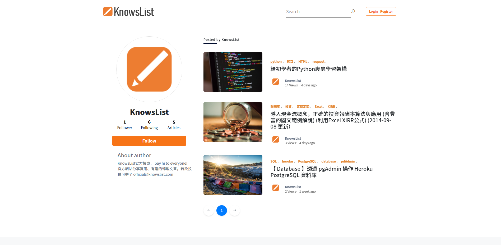
- Following

- Notification
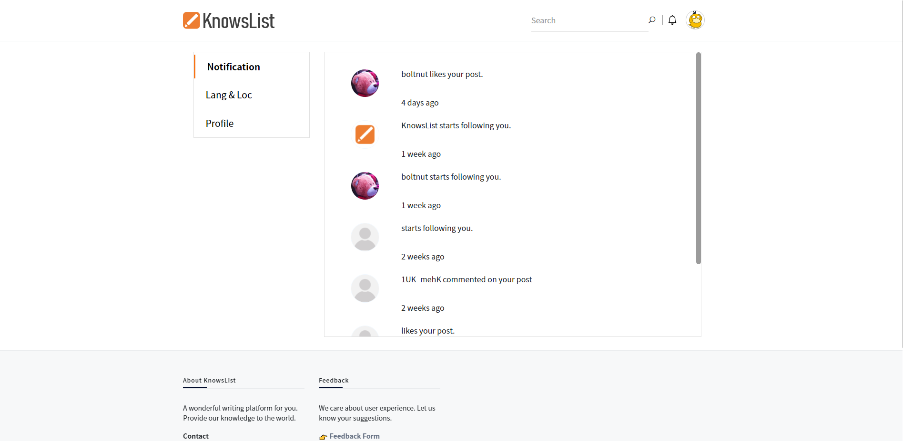
- Loc & Lang
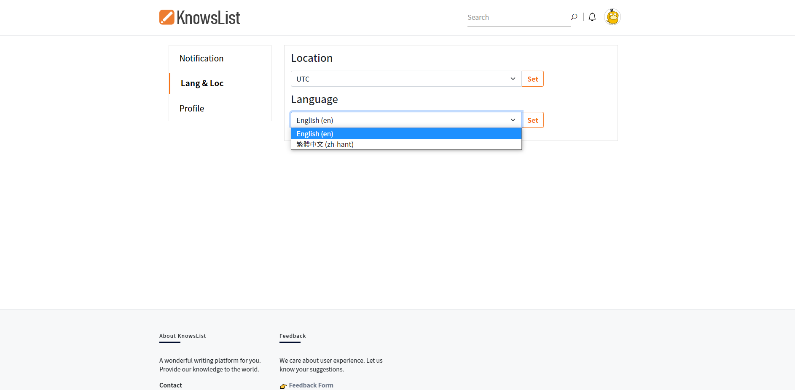
- Stats
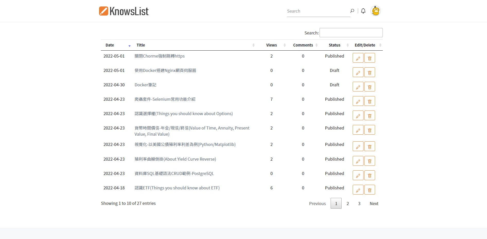
- Login
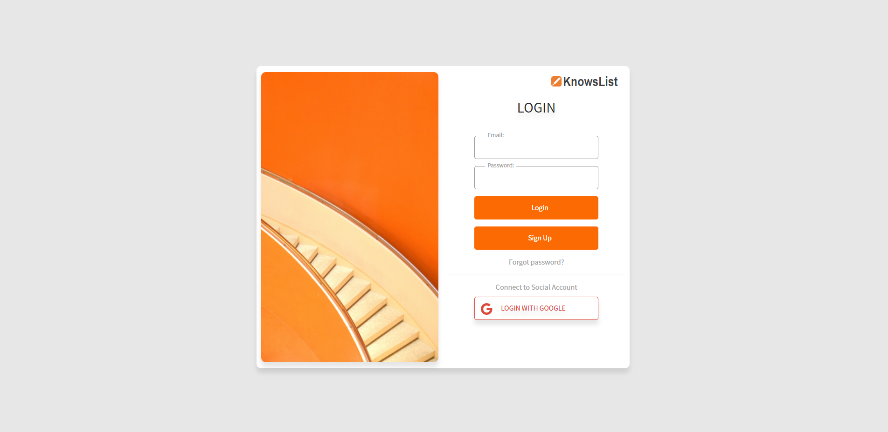
- Social Auth(Gmail)
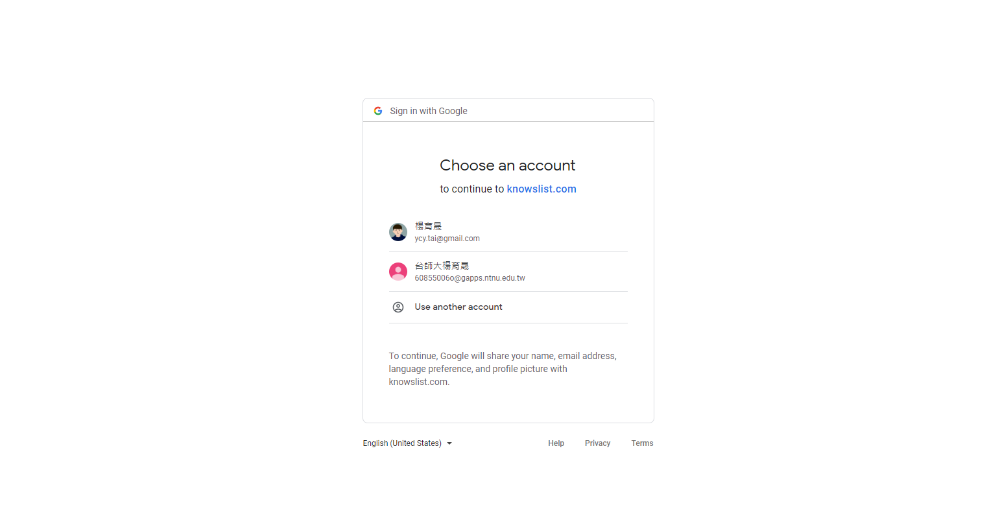
- Google Analytics embedded
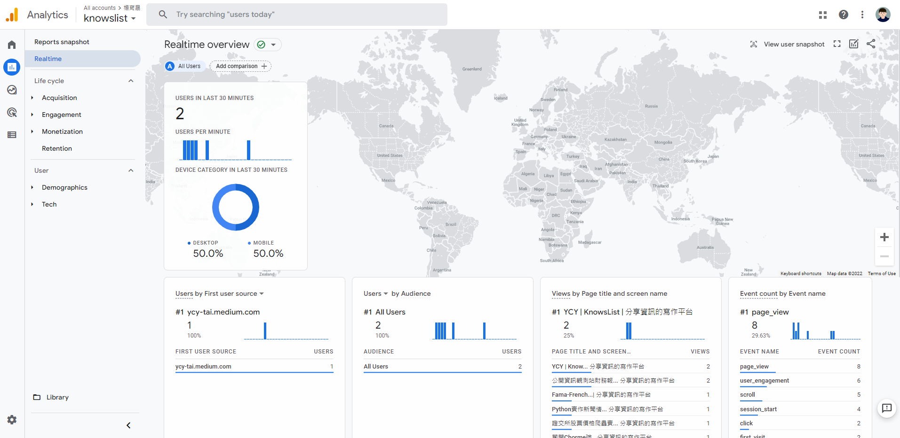
- Routine Task by Celery and Redis
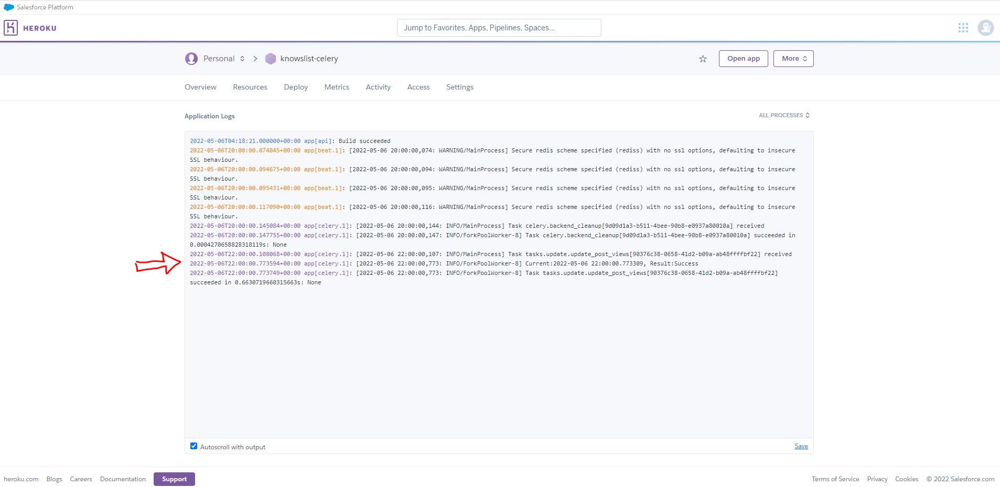

## Features

- Routine task for updating article views (Celery + Redis + GA4 API).
- Sign in via third-party accounts (Gmail).
- Tags for each article (django-taggit).
- Notification (Django signal).
- Responsive web design (RWD).
- Internationalization (i18n).
- Localization (pytz).
- Deployment (Heroku).
- What you see is what you get (CKeditor5).
- Use GA4 to observe user behavior.


## Techniques & tools
### Backend
- [Django(3.2)](https://www.djangoproject.com/)
    - custom user model
    - form
    - signal
    - i18n
    - email
    - fixtures
- [social-auth-app-django](https://github.com/python-social-auth/social-app-django)
    - [Gmail](https://python-social-auth.readthedocs.io/en/latest/configuration/django.html)
- [Celery](https://docs.celeryq.dev/en/stable/getting-started/introduction.html)
- [Redis](https://docs.redis.com/latest/rs/references/client_references/client_python/)
- [GA4 API](https://developers.google.com/analytics/devguides/reporting/data/v1)
- [AWS S3](https://aws.amazon.com/s3/)

### Frontend
- [Bootstrap5](https://getbootstrap.com/)
    - [Bootstrap Tags Input](https://bootstrap-tagsinput.github.io/bootstrap-tagsinput/examples/)
- HTML
- CSS
- JavaScript
- [jQuery](https://jquery.com/)
    - [Ajax](https://api.jquery.com/jquery.ajax/)
    - [Datatable](https://datatables.net/)
    - [Autocomplete](https://jqueryui.com/autocomplete/)
    - [TOC](https://ndabas.github.io/toc/)
- [Themeforest](https://themeforest.net/)

### Database
- [PostgreSQL](https://www.postgresql.org/)


### Deployment

[Heroku](https://www.heroku.com/)


### Structure

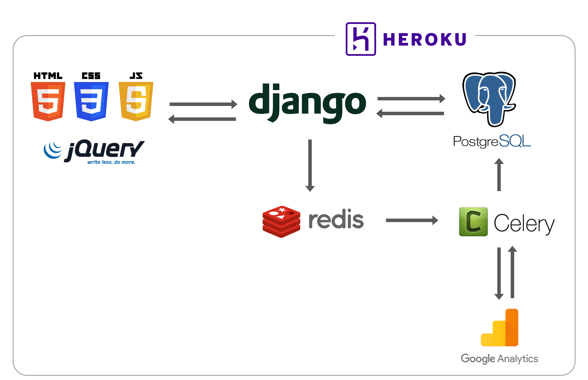


## Set up
### Build virtual environment
```
virtaulenv env
env\Scripts\activate
pip install -r requirements.txt
```

### Django initial
```
python manage.py makemigrations
python manage.py migrate
python manage.py runserver
```
visit http://127.0.0.1:8000/


### Git
```git
git init
git add .
git commit -m "first commit"
git push
```

### Heroku
```
git push heroku master
heroku logs
```

### Translation
```
python manage.py makemessages -l <language> -i env
python manage.py compilemessages
```

### Create & load fixtures
```
python manage.py dumpdata app.Model --indent 4 > fixtures/Model.json
python manage.py loaddata fixtures/Model.json --app app.Model
```

## Reference
- [Login page](https://codepen.io/BetaNow/pen/zYNPPJe)


